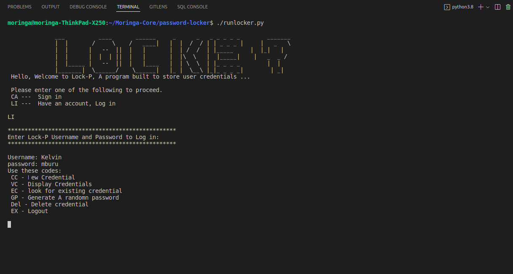

# Password Locker

Project name is a `<tool>` that allows `<any user>` to do `<store their user credentials>`.

## By Kelvin Mburu

## Site Displaying

Here's the app Screenshot:

## Prerequisites

Before you begin, ensure you have met the following requirements:

- You have installed the latest version of `<Python3>`
- You have a `<Windows/Linux/Mac>` machine.
- You have read `<Installation Guide Below>`.

## Installing Password Locker

To install <Password-Locker> follow these steps:

#### Linux and macOS:

- Open project in terminal after cloning.

#### The application requires the following environment variables:

- Python3.8
- Pyperclip
- Pip

#### Windows:

- Open project in Windows terminal after cloning.

## Using Password Locker

To use `<Password Locker>` follow these steps:

- Go to:
- [Github-Repository-Link](https://github.com/kelvinmburu/password-locker.git)
- Git clone the URL to your local PC into a project folder.
- `<cd>` into the project folder
- Open the project using a text editor of your choice.

## Running the Application

To run the application in your terminal, run the commands below:

- $ `<#!/usr/bin/env python3.8>`
- $ `<chmod +x runlocker.py>`
- $ `<./runlocker.py>`

## Want to Contribute to Password Locker?

To contribute to `<Password-Locker>`, follow these steps:

1. Fork this repository.
2. Create a branch: `git checkout -b <branch_name>`.
3. Make your changes and commit them: `git commit -m '<commit_message>'`
4. Push to the original branch: `git push origin <password-locker>/<main>`
5. Create the pull request.

Alternatively see the GitHub documentation on [Creating a Pull Request](https://help.github.com/en/github/collaborating-with-issues-and-pull-requests/creating-a-pull-request).

## Contributors

Thanks to the following people who have contributed to this project:

- [Kelvin Mburu](https://github.com/kelvinmburu) 📖

## Contact

If you want to contact me you can reach me at:

- [mburuhkelvin@gmail.com]
- `<kelvin.wanjiku@student.moringaschool.com>`
- `<kelvin.wanjiku@azubiafrica.org>`

## License

[This project uses an MIT License:](LICENSE).
